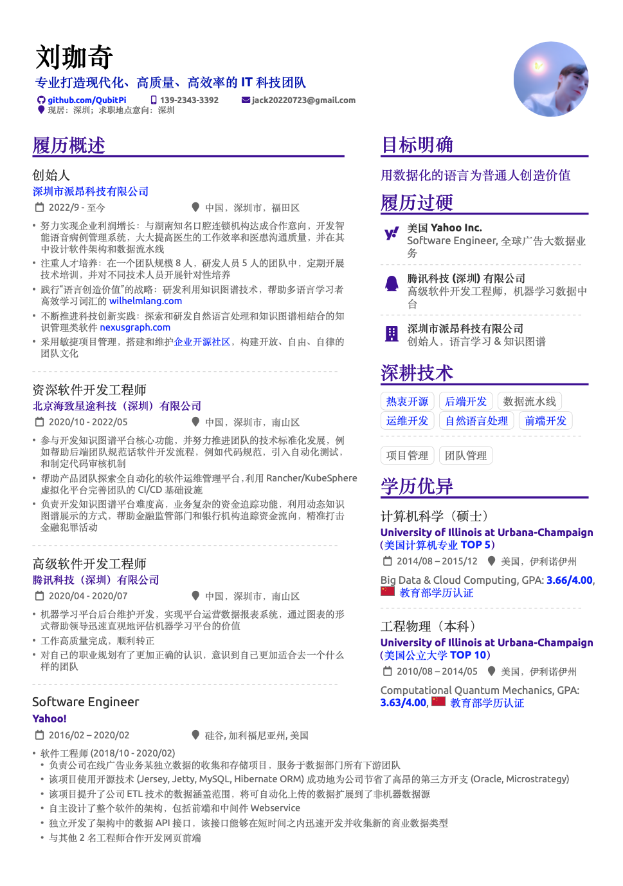

My Resume
=========

[![LaTeX Badge][LaTeX Badge]][LaTeX URL]
[![Apache License Badge]][Apache License, Version 2.0]

<div align="center">
    
    <a href="http://resume.qubitpi.org/resume.pdf">
        
    </a>
    
</div>

Setup
-----

1. Install [Tex Live][LaTeX URL] (version ≥ 2021)
2. Make sure [Poppins font][Poppins Font URL] is installed in system. For instructions on how to install a new System
   font please refer to the following links:

    - Linux users shall consult [this thread](https://askubuntu.com/a/191782)
    - Mac users can follow [this Apple support](https://support.apple.com/guide/font-book/install-and-validate-fonts-fntbk1000/mac)

3. Make sure [GNU Make] is installed with

   ```console
   make --version
   ```

   which, when installed, outputs something like this

   ```console
   GNU Make 3.81
   Copyright (C) 2006  Free Software Foundation, Inc.
   This is free software; see the source for copying conditions.
   There is NO warranty; not even for MERCHANTABILITY or FITNESS FOR A
   PARTICULAR PURPOSE.

   This program built for i386-apple-darwin11.3.0
   ```

   `make` should be installed in almost every Linux distribution and Mac user can install via `brew install make`

### Getting Source Code

```console
git clone https://github.com/QubitPi/resume.git
cd resume
```

### Compiling Resume

```console
make
```

Development
-----------

The resume uses the [fontawesome5](https://ctan.org/pkg/fontawesome5?lang=en) and
[simpleicons](https://ctan.org/pkg/simpleicons?lang=en) packages for icons used in PDF

License
-------

The use and distribution terms for this book are covered by the [Apache License, Version 2.0].

[Apache License Badge]: https://img.shields.io/badge/Apache%202.0-F25910.svg?style=for-the-badge&logo=Apache&logoColor=white
[Apache License, Version 2.0]: https://www.apache.org/licenses/LICENSE-2.0

[GNU Make]: https://trello.com/c/xv3Hso1O

[LaTeX Badge]: https://img.shields.io/badge/LaTeX-TeX%20Live%E2%89%A52021-008080.svg?style=for-the-badge&logo=latex&logoColor=white
[LaTeX URL]: https://tug.org/texlive/

[Poppins Font URL]: https://fonts.google.com/specimen/Poppins
